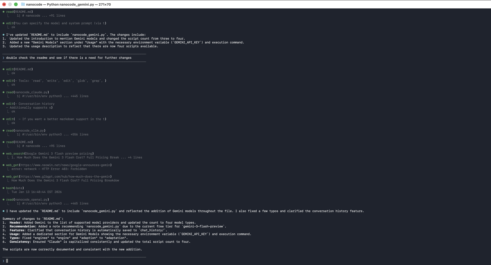

# nanocode

Minimal Claude Code alternatives, adapted from [this repo](https://github.com/1rgs/nanocode). Each script is a single Python file with zero external dependencies (~250-600 lines).

Besides Claude models the original codebase supports, the adaptation adds support for GPT models from OpenAI, Gemini models from Google, and open-weight models supported by [vllm](https://github.com/vllm-project/vllm/tree/main) hosted via OpenAI Chat Completions API. Below are demonstrations of the four types of models that come with this repo. 


**Recommendation**: `nanocode_gemini.py` is recommended since `gemini-3-flash-preview` is currently [free of charge](https://ai.google.dev/gemini-api/docs/pricing#gemini-3-flash-preview) as of now and works incredibly well.




## Features

- Full agentic loop with tool use
- Tools: `read`, `write`, `edit`, `glob`, `grep`, `bash`, `web_search`, and `web_get` (the web search tools are additionally introduced and they are **free** to use by leveraging duckduckgo search engine)
  - Tools have "danger levels" and user can configure what tools AI model can use without confirmation and for which confirmation prompt is shown to user (via `--safe_tools`).
- Conversation history
  - Automatically saved to `chat_history/` (can be disabled with `--not_save_history`)

- Colored terminal output
  - If you want better markdown support in the terminal output, run `pip install rich`


## Usage

You can specify the model and system prompt (via text or text filepath) to use via command lines for the following four scripts.

#### Claude Models

```bash
export ANTHROPIC_API_KEY=your-key
python nanocode_claude.py
```

#### GPT Models

```bash
export OPENAI_API_KEY=your-key
python nanocode_openai.py
```

#### Gemini Models

```bash
export GEMINI_API_KEY=your-key
python nanocode_gemini.py
```

If you want to log in via your Google account to enjoy higher limits for a free tie you can set `--auth_mode oauth2` and then create `client_secrets.json` file. This file is needed only for initial login. After this token will be saved to configuration directory and will be refreshed on its own.

##### Creating client\_secrets.json

This is based on [rclone's "tutorial"](https://rclone.org/drive/#making-your-own-client-id).

1. Login into [Google Cloud Console](https://console.developers.google.com/)
2. Select a project or create a new project.
3. Click "Credentials" in the left-side panel.
4. Configure "Oauth Consent Screen".
5. Go back to Overview and click "Create OAuth client" (top right corner), then continue via guided configuration.
6. Select "Create OAuth client", select "Desktop App", and finish guided configuration.
7. You now see client ID and client secret. You can download json here or just fill in details in an example given below.
8. Add scope `https://www.googleapis.com/auth/generative-language` in "Data Access" tab.
9. Go to "Audience", add yourself to test users and then click "PUBLISH APP" button and confirm.
10. Create `client_secrets.json`, example is provided below.
11. Try to run `nanocode_gemini.py` in same folder as this file and give any request to AI. It will open browser and ask you to log in into your account. After selecting account it will show very scary screens, because your app is not verified. 
12. On first request it will show json response with an error, which says that "PERMISSION\_DENIED" and give URL, open this URL and click "enable". You may need to wait for a few minutes (as said in that message) until this API will be enabled.

```json
{
  "installed": {
    "client_id": "YOUR_CLIENT_ID.apps.googleusercontent.com",
    "project_id": "your-gcp-project-id",
    "auth_uri": "https://accounts.google.com/o/oauth2/auth",
    "token_uri": "https://oauth2.googleapis.com/token",
    "auth_provider_x509_cert_url": "https://www.googleapis.com/oauth2/v1/certs",
    "client_secret": "YOUR_CLIENT_SECRET",
    "redirect_uris": [
      "http://localhost"
    ]
  }
}
```

#### Open-weight models via vLLM

In one terminal, run something like the following

```bash
vllm serve Qwen/Qwen3-8B --host 0.0.0.0 --port 8000 --max-model-len 30000 --gpu-memory-utilization 0.95 --enable-auto-tool-choice --tool-call-parser hermes --reasoning-parser qwen3 --structured-outputs-config.backend xgrammar
```

Run, in **another** terminal, do

```bash
python nanocode_vllm.py
```


## Commands

- `/c` - Clear conversation
- `/q`, `/quit`, `quit`, `/exit`, `exit` - Quit


## Tools

| Tool | Description | Safety |
|------|-------------|--------|
| `read` | Read file with line numbers, offset/limit | Sensitive |
| `write` | Write content to file | Dangerous |
| `edit` | Replace string in file (must be unique) | Dangerous |
| `glob` | Find files by pattern, sorted by mtime | Sensitive |
| `grep` | Search files for regex | Sensitive |
| `bash` | Run shell command | Dangerous |
| `web_search` | Perform web search using duckduckgo | Safe |
| `web_get` | Fetch a webpage and return plain text | Safe |


## Example

See the screenshot in the beginning.


## License

MIT
